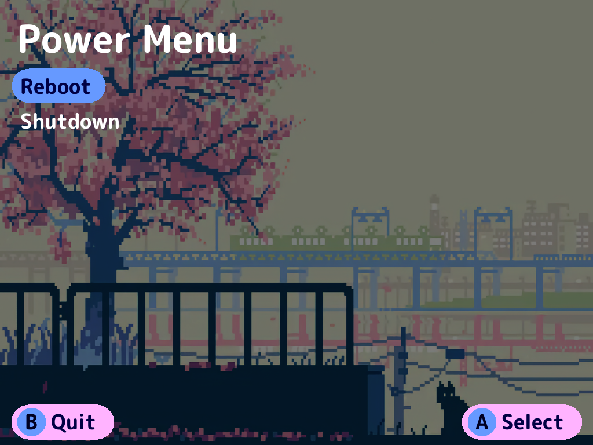

<h1 style="font-size: 45px;">
    NextUI Power Menu
</h1>

## [Download this in Pak Store!](https://github.com/UncleJunVIP/nextui-pak-store)

---

### How do I use this Pak?

1. Install it via [Pak Store](https://github.com/UncleJunVIP/nextui-pak-store). It can be found under `System`.
2. Launch it.
3. Pick Reboot or Shutdown.
4. That's all this does...

### What does this not do?

[Download more RAM](http://www.downloadmoreram.com).
